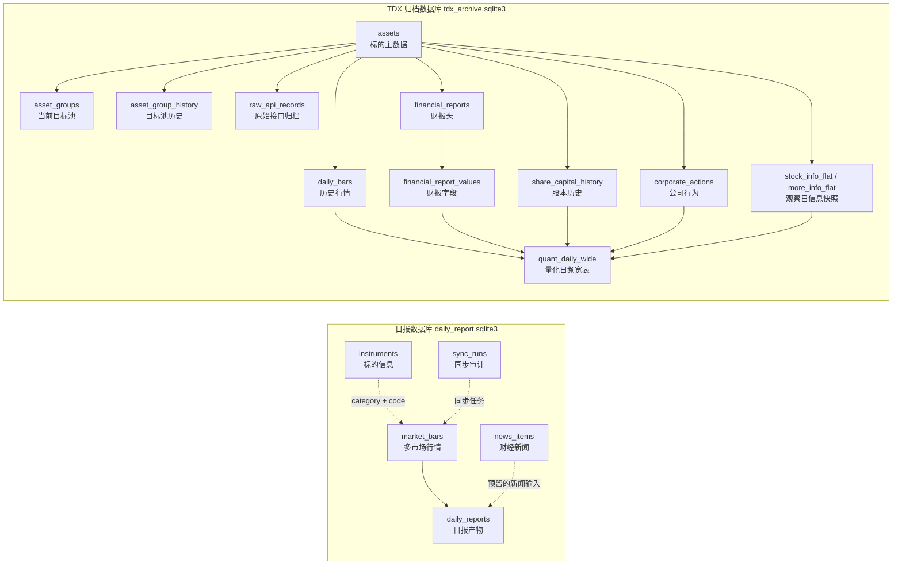
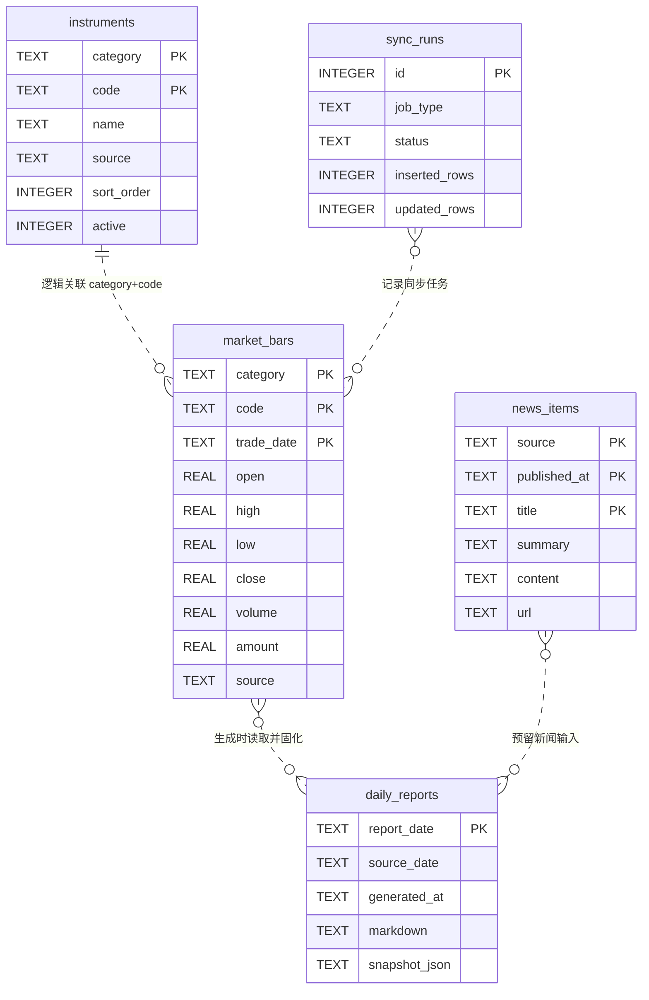
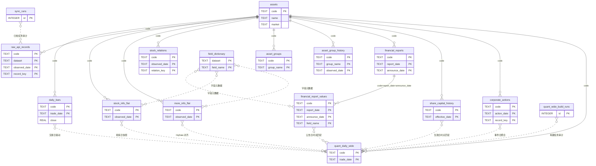

# 整体数据库数据模型

## 1. 范围与边界

项目使用两个相互独立的 SQLite 数据库：

- `data/daily_report.sqlite3`：服务于每日市场日报，保存关注标的、行情缓存、财经新闻和最终日报。
- `data/tdx_archive.sqlite3`：服务于 TDX 数据归档与量化研究，保存原始接口记录、规范化历史数据、观察日快照和日频量化宽表。

两个数据库之间没有物理外键或跨库 SQL 依赖，只在业务语义上共享证券代码和交易日期。数据库文件、WAL/SHM 文件及其中的数据均为本地生成数据，不纳入 Git。

本文描述 2026-08-25 的代码 schema 和实库状态。行数与时间范围会随日常采集继续增长。

## 2. 整体模型

## 3. 日报数据库

### 3.1 数据模型

日报库目前没有声明物理外键，图中的关系均为代码和业务语义上的逻辑关系。

### 3.2 表的分类与用途

| 表 | 分类 | 主键 | 2026-08-25 行数 | 用途 |
|---|---|---|---:|---|
| `instruments` | 信息表/主数据 | `(category, code)` | 32 | 日报关注标的清单，保存名称、来源、排序和启用状态。 |
| `market_bars` | 业务事实表 | `(category, code, trade_date)` | 37,605 | 保存多市场 OHLCV、成交额历史，并用于计算三年价格分位。 |
| `news_items` | 业务事实表 | `(source, published_at, title)` | 0 | 对财经新闻去重存储，保留摘要、正文、URL 和采集时间。 |
| `daily_reports` | 业务产物表 | `report_date` | 3 | 每个自然日只保存第一份成功日报，同时固化 Markdown 和完整 JSON 快照。 |
| `sync_runs` | 运维审计表 | `id` | 0 | 记录同步任务状态、新增/更新行数和异常信息。 |

`instruments` 与 `market_bars` 通过 `(category, code)` 逻辑关联。日报生成服务读取最新行情，计算指标并把结果固化到 `daily_reports.snapshot_json` 和 `markdown`；源行情后续变化不会自动改写历史日报。

`news_items` 已有独立采集 CLI 和 repository，但当前 `generate_market_report()` 尚未读取该表，因此它与 `daily_reports` 的关系是预留的数据流，而不是已接通的数据流。

## 4. TDX 归档数据库

### 4.1 核心实体关系

实线表示 schema 中声明的物理外键；虚线表示构建或查询服务使用的逻辑关系。

### 4.2 信息、配置和关系表

| 表 | 分类 | 主键 | 2026-08-25 行数 | 用途 |
|---|---|---|---:|---|
| `assets` | 信息表/主数据 | `code` | 927 | TDX 标的根表，其他主要业务表通过 `code` 指向它。 |
| `field_dictionary` | 信息表/元数据 | `(dataset, field_name)` | 159 | 解释动态 API 字段的中文名称、分组和数据类型。 |
| `asset_groups` | 业务配置/当前关系表 | `(code, group_name)` | 920 | 当前沪深300、中证500和高流动性 ETF 目标池，决定每日采集和宽表构建范围。 |
| `asset_group_history` | 业务历史/关系快照表 | `(code, group_name, observed_date)` | 1,338 | 保存每个观察日的目标池成员和流动性排名，用于还原历史股票池并避免幸存者偏差。 |
| `stock_relations` | 业务关系快照表 | `(code, observed_date, relation_key)` | 64,755 | 保存个股关联板块、标签等接口关系数据。 |

`asset_groups` 是当前快照，刷新时会覆盖某个标的原有的当前关系；`asset_group_history` 是按观察日追加的历史快照。当前表用于决定今天采集哪些标的，历史表用于回答“某个历史日期该标的是否属于某个目标池”。

### 4.3 原始层、业务事实与观察日快照

| 表 | 分类 | 主键 | 2026-08-25 行数 | 用途 |
|---|---|---|---:|---|
| `raw_api_records` | 原始业务归档表 | `(code, dataset, observed_date, record_key)` | 3,041,939 | 保留 TDX 接口完整 JSON，用于审计、重放和重新解析。 |
| `daily_bars` | 核心业务事实表 | `(code, trade_date)` | 3,026,059 | 标准化日线、成交量额、复权因子和流通量，是宽表的日期驱动数据。 |
| `stock_info_flat` | 业务快照表 | `(code, observed_date)` | 2,178 | 公司财务快照、行业、ST、指数成份和融资融券等属性。 |
| `more_info_flat` | 业务快照表 | `(code, observed_date)` | 2,178 | PE、PB、股息率、换手率、Beta、市值和最近重要事件日期。 |
| `financial_reports` | 核心业务事实表 | `(code, report_date, announce_date)` | 49,590 | 保存财报完整原文，并维护报告期与公告日双时间轴。 |
| `financial_report_values` | 核心业务明细表 | `(code, report_date, announce_date, field_name)` | 396,720 | 将财报字段拆成长表；当前为 800 只股票的 FN193～FN200。 |
| `share_capital_history` | 核心业务事实表 | `(code, effective_date)` | 2,990,271 | 按生效日保存流通股本和总股本。 |
| `corporate_actions` | 核心业务事件表 | `(code, action_date, record_key)` | 12,456 | 保存分红、送股、配股等公司行为。 |

`financial_reports` 与 `financial_report_values` 通过 `(code, report_date, announce_date)` 形成受复合外键约束的头表—明细表关系。

### 4.4 派生读模型与审计表

| 表 | 分类 | 主键 | 2026-08-25 行数 | 用途 |
|---|---|---|---:|---|
| `quant_daily_wide` | 派生业务表/量化读模型 | `(code, trade_date)` | 2,990,272 | 按标的和交易日汇总价格、技术特征、当时已知财报、股本、公司行为、估值快照、行业和标签。 |
| `sync_runs` | 运维审计表 | `id` | 8 | 记录 TDX 归档任务的请求标的数、新增日线数、失败数和状态。 |
| `quant_wide_build_runs` | 运维审计表 | `id` | 4 | 记录量化宽表构建的写入行数、失败标的和状态。 |

宽表的时点匹配规则：

1. 以 `daily_bars(code, trade_date)` 生成每个交易日的基础行。
2. 财报只选择 `announce_date <= trade_date` 且报告期不晚于交易日的最新已知记录。
3. 股本选择 `effective_date <= trade_date` 的最近有效记录。
4. 公司行为按 `action_date` 聚合到交易日，并计算距离最近事件的天数。
5. `more_info_flat` 优先使用内部 `HqDate` 对齐交易日，同时保留真实 `observed_date`。
6. 价格收益和均线只使用当前及过去交易日数据，不在基础宽表中保存未来收益标签。

## 5. 当前数据范围

| 数据集 | 标的数 | 时间范围 |
|---|---:|---|
| 日报 `market_bars` | 29 个实际有行情的标的 | 各类别不同，整体最长覆盖 2021-02-09～2026-08-25 |
| TDX `daily_bars` | 927 | 2004-01-02～2026-08-24 |
| `financial_reports` | 800 只股票 | 报告期 2003-06-30～2026-03-31 |
| `share_capital_history` | 920 | 2004-01-02～2026-08-24 |
| `corporate_actions` | 837 | 2004-01-16～2026-08-24 |
| `quant_daily_wide` | 920 | 2004-01-02～2026-08-24 |

量化宽表的920个标的包括800只股票和120只 ETF。`assets` 与 `daily_bars` 另外包含7个早期或非当前目标标的，当前目标池和量化宽表不包含它们。

## 6. 已知约束与后续注意事项

1. 日报库没有物理外键，`market_bars` 与 `instruments` 之间可能产生数据库无法自动阻止的孤儿行。
2. `news_items` 尚未接入当前日报生成服务，实库当前也是空表。
3. `assets.market` 当前主要保存 `targeted`，不是稳定的 `SH/SZ` 交易所枚举；`quant_daily_wide.market` 继承该值，不能直接用于交易所分组。
4. `stock_info_flat` 和 `more_info_flat` 会随接口字段动态增加列，适合快速归档，但 schema 与类型约束弱于固定字段表。
5. `quant_daily_wide` 是物化副本，没有触发器自动跟随源表更新；完成每日增量采集后需要再次运行宽表构建任务。
6. 当前 `asset_group_history` 只从启用目标池历史功能后开始积累，不能单独还原更早年份的真实指数成份；长期回测仍需补充历史指数成份数据。

## 7. 代码来源

- 日报数据库 schema：`daily_report/storage/database.py`
- 日报行情与标的持久化：`daily_report/storage/market_repository.py`
- 新闻持久化：`daily_report/storage/news_repository.py`
- 日报固化：`daily_report/storage/report_repository.py`
- 日报生成数据流：`daily_report/service.py`
- TDX 数据库 schema 与持久化：`tdx_data/repository.py`
- TDX 历史时点查询：`tdx_data/history_service.py`
- 量化宽表物化：`tdx_data/quant_wide_service.py`

