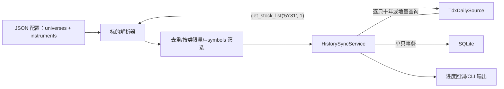

# Design: 通达信 A 股与 ETF 全标的十年日线归档

## Requirement Link

- [通达信 A 股与 ETF 全标的十年日线归档](../requirements/tdx-all-a-etf-history.md)

## Current System

`tdx_history` 已有四层：

- `config.py`：读取手工证券配置。
- `tdx_source.py`：连接 TQ，逐只读取日线。
- `service.py`：根据库内最新交易日决定首次回补或增量查询。
- `repository.py`：SQLite schema、证券主数据和幂等日线写入。

现有架构的主要缺口是“证券集合发现”与“全量运行的安全开关/进度”，持久化数据模型无需迁移。

## Proposed Architecture



### Module Boundaries

- `config.py`：增加 `UniverseSpec`，校验 `market/kind/dividend_type`；允许 `universes` 和 `instruments` 任一非空。
- `tdx_source.py`：增加 `list_instruments(spec)`，只负责 TQ 列表响应的校验和转换。
- `universe.py`：新增纯逻辑，合并手工/自动标的、按代码去重、筛选代码、按类限量。
- `service.py`：增加可选 `on_result` 回调，每只完成即向 CLI 报告，不改变同步语义。
- `cli.py`：编排连接、发现、选择和同步；默认 `--limit-per-kind 5`，`--all` 显式解除限制。
- `repository.py`：保持当前 schema，无迁移。

## Data Model

继续使用当前数据模型：

```text
instruments(code PK, name, kind, dividend_type, updated_at)
daily_bars(code FK, trade_date, open, high, low, close, volume, amount, created_at,
           PK(code, trade_date)) WITHOUT ROWID
sync_runs(id PK, started_at, finished_at, requested_codes,
          inserted_rows, failed_codes, status, message)
```

不将“当次发现集合”作为新表持久化；`instruments` 本身在首次同步前 upsert，足以表示已实际进入同步的标的。

## Interfaces

### Configuration

```json
{
  "tdx_user_dir": "D:\\SoftWare\\TDX\\PYPlugins\\user",
  "universes": [
    {"market": "5", "kind": "stock", "dividend_type": "none"},
    {"market": "31", "kind": "etf", "dividend_type": "none"}
  ],
  "instruments": []
}
```

### Data Source

```python
def list_instruments(self, universe: UniverseSpec) -> tuple[Instrument, ...]: ...
```

TQ 调用合同：

```python
tq.get_stock_list(universe.market, list_type=1)
```

`list_type=1` 要求返回 `{"Code": ..., "Name": ...}`；非列表、非字典或缺字段均视为数据源错误。

### CLI

- `tdx-history`：默认 A 股 5 个 + ETF 5 个。
- `tdx-history --limit-per-kind 10`：每类 10 个。
- `tdx-history --all`：全部 A 股 + ETF。
- `tdx-history --symbols 600519.SH 510300.SH`：精确代码，不再应用每类限制。

`--all` 与显式 `--limit-per-kind` 互斥，避免命令意义不清。

## Security And Permissions

- 仅读取本地通达信行情，不调用账户、下单、自选股或公网服务。
- 数据库仅写用户指定或项目 `data/` 路径。
- 不读取或保存凭证，不将数据库提交 Git。

## Failure Modes

- 列表发现失败：在启动同步前终止，避免用不完整集合冒充全量。
- 单只日线失败：记录 `failed`，继续下一只，最终非零退出。
- 进程中断：已提交证券保留；重运时通过 `MAX(trade_date)` 续传。
- 重复代码：解析阶段按代码去重，数据库主键再次防重。
- 盘中运行：继续使用 16:30 截止规则，除非显式 `--include-today`。

## Alternatives Considered

1. **将全部代码固化到 JSON**：无需运行时发现，但会快速过期且需要频繁提交数千行配置，拒绝。
2. **一次将所有代码传给 `get_market_data`**：封装内部仍逐只调用 DLL，且会在内存中合并全部 DataFrame，恢复性更差，拒绝。
3. **每只一个 CSV**：直观，但原子性、唯一性、查询和运行记录都弱于 SQLite，拒绝。
4. **默认直接全量**：命令简单，但误操作成本高；选择默认冒烟、`--all` 显式全量。

## Risks

- SQLite 单库在数千标的十年数据下可达数 GB；当前结构适合本地单写者，不适合多进程并发写。
- 全量同步仍可能需要数小时；本次优先正确性和恢复性，不引入并发 DLL 调用。
- `get_stock_list` 集合数量是运行时数据，仅在冒烟报告中记录当时数量。

## Verification Strategy

- 配置解析、列表转换、非法响应、去重、每类限量和代码筛选的离线单元测试。
- 现有 SQLite 唯一性、首次/增量、失败隔离回归测试。
- 真实通达信每类 5 个标的的首次与第二次运行。
- SQLite 行数、类型数、日期范围、重复键、空收盘价与 `integrity_check`。
- 全仓 `pytest` 和 `git diff --check`。

## Implementation Notes

- 发现结果按 TQ 返回顺序保留；去重时首个定义胜出。
- 默认配置改为 A 股与 ETF 两个集合，手工列表保留为空数组。
- 不修改现有 SQLite schema，因此没有数据库迁移。
