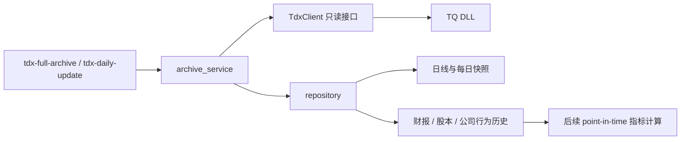

# 设计：TDX 每日增量与双时间轴财务数据

## 需求链接

[TDX 每日增量与历史财务归档](../requirements/tdx-daily-incremental.md)

## 当前系统

`cli.py` 调用 `archive_service.archive_stocks`，后者通过 `TdxClient` 获取日线、基础资料、扩展资料和关系，再由 `repository.py` 写入 SQLite。日线已按最后日期续传，附加历史接口仅在 `additional_data.py` 打印。

## 目标架构

- `tdx-full-archive`：可从公开清单或 TQ 股票列表初始化/刷新标的，并执行同一套增量归档。
- `tdx-daily-update`：从数据库读取现有标的，每天续传，不依赖 AkShare。
- `archive_service`：在运行开始确定 `snapshot_date`，为每只证券分别计算日线和历史数据起点。
- `repository`：保存当前快照、原始返回及可查询的历史实体。

## 数据模型

新增表：

- `financial_reports(code, report_date, announce_date, payload_json, captured_at)`：报告期和公告日双时间轴。
- `financial_report_values(code, report_date, announce_date, field_name, numeric_value, text_value)`：财务字段 EAV 明细，兼容未来新增字段。
- `share_capital_history(code, effective_date, float_shares, total_shares, payload_json, captured_at)`。
- `corporate_actions`：除完整 payload 外，直接保存行为类型、现金分红、送股、配股和配股价。
- `asset_group_history(code, group_name, observed_date, liquidity_rank, latest_amount, captured_at)`。

现有 `raw_api_records` 继续保存完整接口返回；单点和当日扩展数据按 `snapshot_date` 保存。

## 使用层

`history_service.py` 提供：

- `financial_report_as_of`：查询指定日期当时已经公告、报告期最新的财报版本；
- `share_capital_as_of`：查询指定日期有效的最近股本；
- `historical_metric_inputs`：一次性合并交易日收盘价、当时财报字段和当时股本；
- `corporate_actions_between`：读取结构化公司行为；
- `calculate_historical_pb`：必须显式指定已验证的每股净资产字段。

选择财报时先限制 `announce_date <= trade_date`，再按 `report_date` 选择最新报告期，并在同报告期内选择最新公告版本。这样既避免未来函数，也避免一份旧报告期的迟到更正错误覆盖更新季度。

## 增量规则

| 数据 | 起点 | 幂等键 |
|---|---|---|
| 日线 | 最后交易日 + 1 天 | 代码 + 交易日 |
| 财报 | 最后公告日向前重叠 31 天 | 代码 + 报告期 + 公告日 |
| 股本 | 最后生效日向前重叠 31 天 | 代码 + 生效日 |
| 公司行为 | 最后行为日向前重叠 31 天 | 代码 + 行为日 + 行内键 |
| 每日快照 | 本次统一快照日 | 代码 + 数据集 + 快照日 |

## 历史 PB 计算边界

正确的历史 PB 应在每个交易日 `t` 选择 `announce_date <= t` 的最新财报，再用未复权收盘价除以该财报的每股净资产。不能把今天的净资产快照回填到过去。本机 TQ 实测不支持从 `get_market_data` 直接取历史 `PB_MRQ`；虽然插件文档把 Fn196 标为每股净资产，但样本值异常，因此本次只归档原始字段，不生成误导性 PB。

## 失败处理与可观测性

- 单证券事务提交；失败时回滚该证券本轮写入并继续。
- `sync_runs` 记录处理数量、日线新增数和失败数。
- 历史接口返回空集合视为无新增，不视为程序异常。

## 备选方案

- 仅保存每日 `more_info.PB_MRQ`：从现在开始可形成真实每日 PB，但无法补历史。
- 使用第三方财报 API：字段更完整，需新增数据源、口径映射和授权，不属于本次范围。

## 验证策略

- 注入 Fake TDX 客户端验证参数、增量起点、幂等和跨午夜快照一致性。
- 用临时 SQLite 验证旧库兼容建表与历史实体唯一性。
- 本机只对单只股票做只读接口取证，不执行全市场写入。
